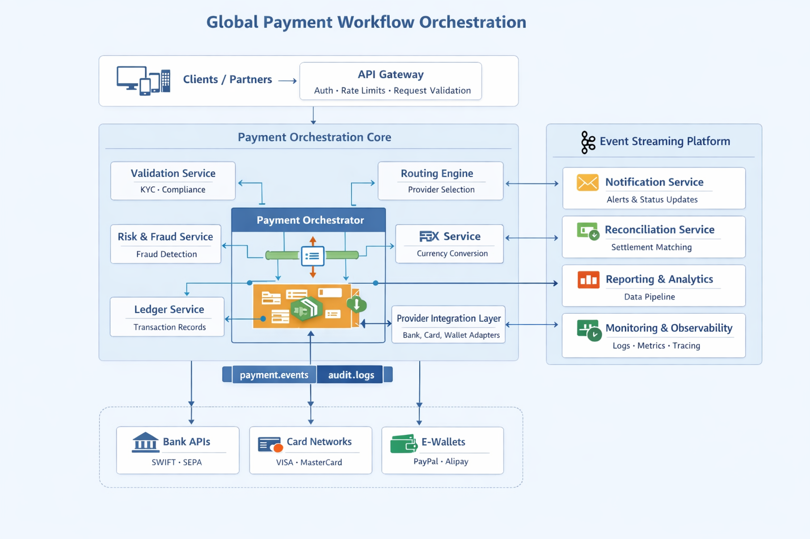

# Payment Workflow Orchestration Architecture

This repository showcases a sample architecture design for a **Global Payment Workflow Orchestration Platform**.

The goal of this project is to demonstrate how a modern payment system can be designed to support **high-volume transactions**, **multiple payment providers**, and **reliable distributed processing** using microservices and event-driven patterns.

This is a personal learning and showcase project reflecting how I approach designing scalable backend systems in the **FinTech and Payments domain**.

---

## Overview

Payment systems often need to integrate with multiple providers such as:

- Banks (SEPA, SWIFT)
- Card Networks (Visa, Mastercard)
- Wallets (PayPal, Alipay)

Each provider has different APIs, response times, and reliability characteristics. A workflow orchestration layer helps standardize these integrations and manage payment state consistently.

This architecture demonstrates how to:

- orchestrate payment workflows
- integrate multiple providers
- maintain reliable transaction records
- support event-driven communication
- ensure observability and traceability
- scale platform safely

---

## Architecture Diagram

---

## Repository Structure

├── README.md
├── architecture-overview.md
├── payment-flow.md
├── trade-offs.md
├── problem-statement.md
├── requirements.md
└── diagrams

---

## Documents

### Problem Statement

Describes the challenges in building scalable payment platforms and the motivation behind this design.

problem-statement.md

---

### Requirements

High-level functional and non-functional expectations for the system.

requirements.md

---

### Architecture Overview

Explains the core components and how they interact.

architecture-overview.md

---

### Payment Flow

Step-by-step explanation of how a payment moves through the system.

payment-flow.md

---

### Design Trade-offs

Key architectural decisions and why certain approaches were chosen.

trade-offs.md

---

## Key Concepts Covered

- microservices architecture
- event-driven systems
- payment orchestration patterns
- provider abstraction
- distributed system reliability
- observability patterns
- scalable API platform design

---

## Example Technology Stack

The architecture is technology-agnostic but aligns well with:

- Java / Spring Boot
- Kafka
- AWS / Kubernetes
- PostgreSQL
- REST APIs

---

## Purpose

This repository is part of my architecture portfolio to demonstrate:

- system design thinking
- distributed systems understanding
- payments domain experience
- ability to communicate technical concepts clearly

---

## Related Portfolio Sections

Architecture Portfolio:
https://sanjairamesh.github.io/architecture/

---

## Author

Ramesh Boopathi

Staff / Principal Software Engineer

Distributed Systems | Payments | AWS | Java