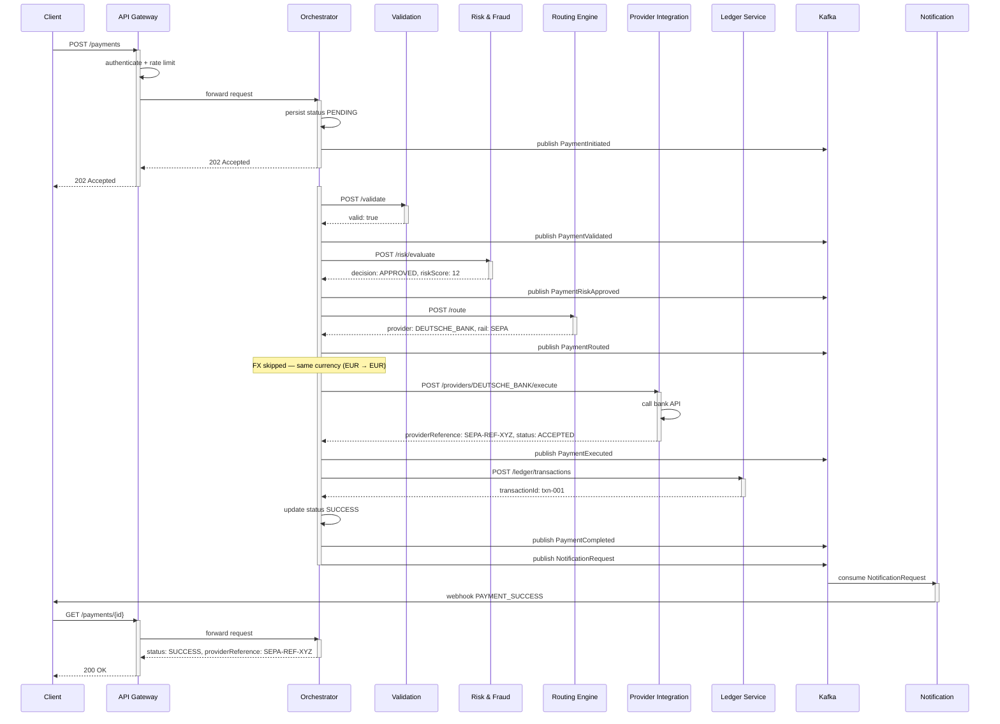
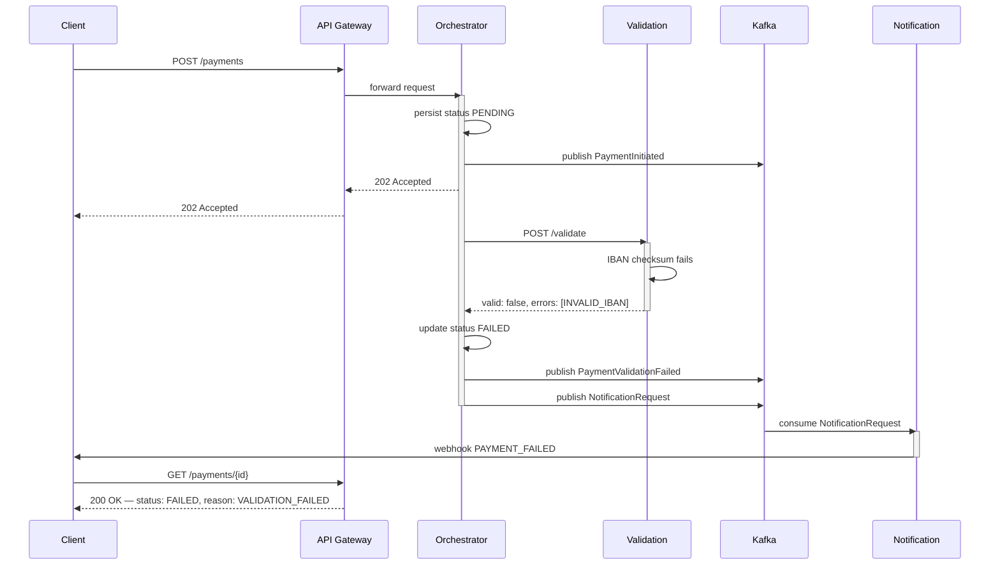
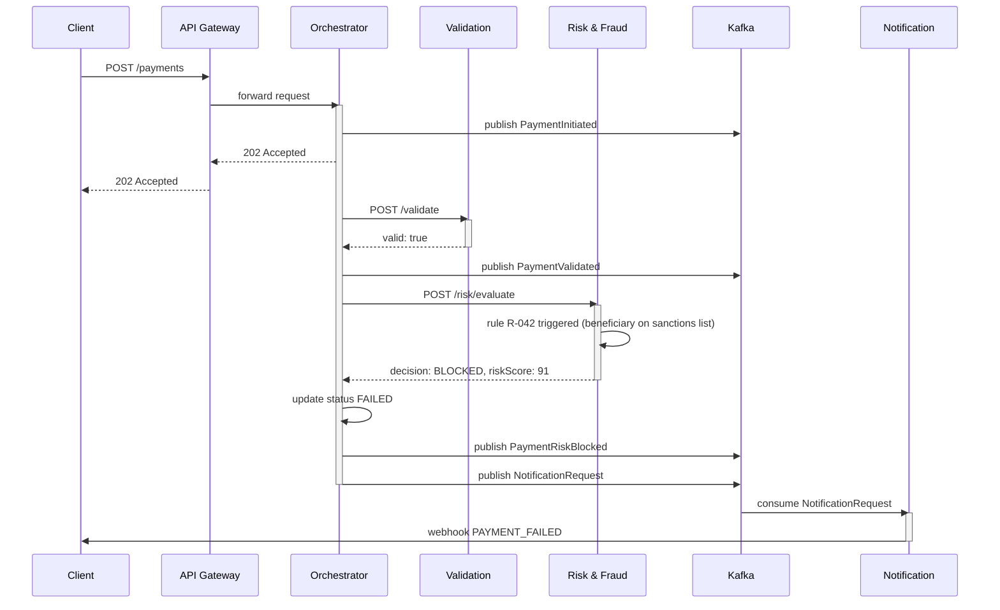
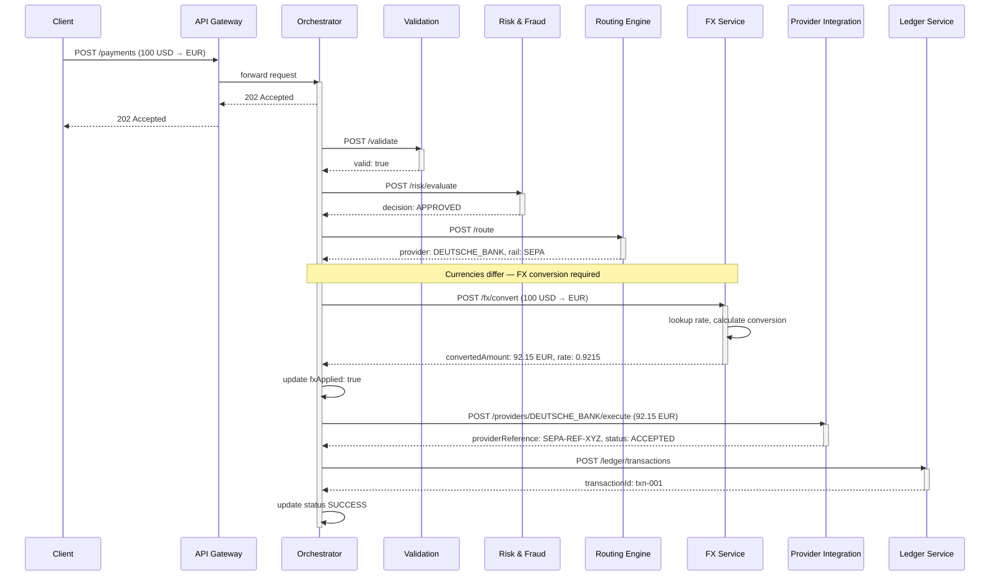
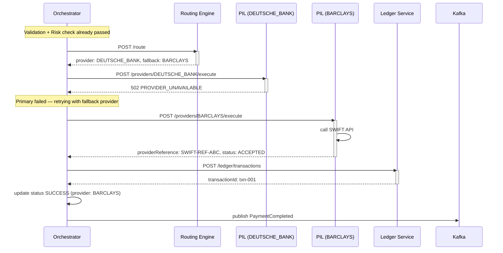
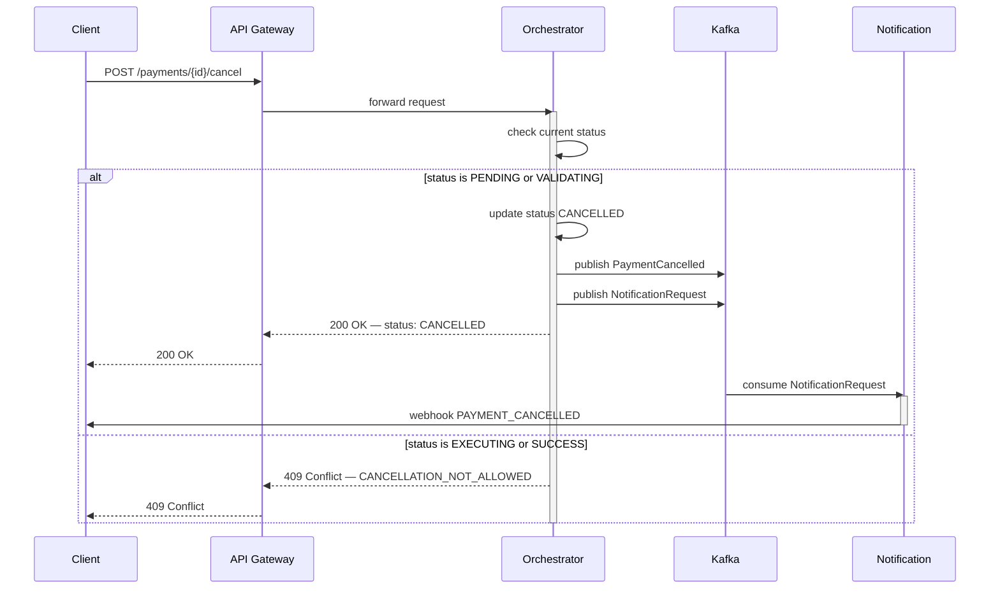
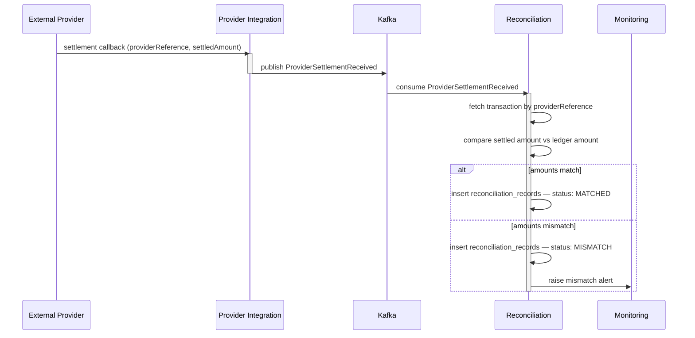
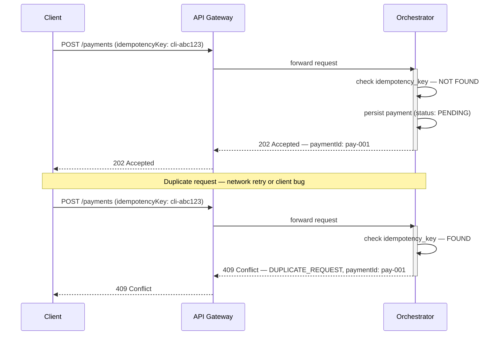

# LLD 05 — Sequence Diagrams

This document describes the step-by-step interaction flows between services for the most important scenarios in the platform.

Diagrams are written in [Mermaid](https://mermaid.js.org/) and render natively on GitHub.

---

## Scenarios

1. [Happy Path — Same Currency Bank Transfer](#1-happy-path--same-currency-bank-transfer)
2. [Validation Failure](#2-validation-failure)
3. [Risk Block](#3-risk-block)
4. [Cross-Currency Payment — FX Applied](#4-cross-currency-payment--fx-applied)
5. [Provider Failure with Retry](#5-provider-failure-with-retry)
6. [Payment Cancellation](#6-payment-cancellation)
7. [Provider Settlement Callback — Reconciliation](#7-provider-settlement-callback--reconciliation)
8. [Idempotency — Duplicate Request Handling](#8-idempotency--duplicate-request-handling)

---

## 1. Happy Path — Same Currency Bank Transfer

Standard EUR-to-EUR SEPA payment with no issues at any step.

---

## 2. Validation Failure

Payment is rejected at the validation step due to an invalid IBAN. Workflow stops immediately and the client is notified.

---

## 3. Risk Block

Payment passes validation but is blocked by the fraud engine due to a sanctions list match.

---

## 4. Cross-Currency Payment — FX Applied

USD payment where the beneficiary receives EUR. FX conversion is applied after routing and before execution.

---

## 5. Provider Failure with Retry

Primary provider returns 502. Orchestrator retries automatically using the fallback provider returned by the Routing Engine.

---

## 6. Payment Cancellation

Client requests cancellation. Allowed only if the payment has not yet been submitted to a provider.

---

## 7. Provider Settlement Callback — Reconciliation

Provider sends an async settlement confirmation. Reconciliation Service matches it against the internal ledger record.

---

## 8. Idempotency — Duplicate Request Handling

Client sends the same request twice with the same `idempotencyKey`. Second request returns the original response without creating a new payment.

---

## Key Patterns Illustrated

| Pattern | Scenario |
|---|---|
| Synchronous orchestration across services | 1, 4 |
| Early rejection before execution | 2, 3 |
| FX conversion pre-execution | 4 |
| Fallback provider retry | 5 |
| Conditional cancellation guard | 6 |
| Async settlement reconciliation | 7 |
| Idempotency key deduplication | 8 |
| Event-driven downstream processing | 1, 2, 3, 6 |
